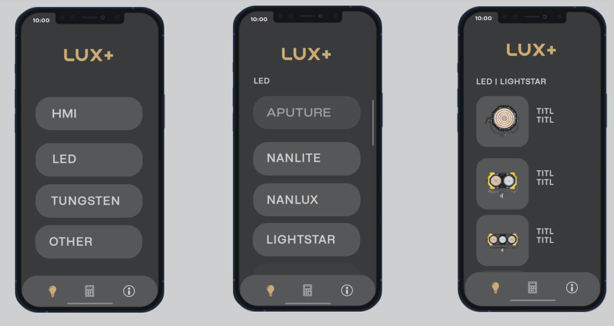

# Документация по проекту LUX+

## Описание

Приложение LUX+ предназначено для расчета освещенности (люксов) в зависимости от параметров осветительных приборов и условий съемки. Приложение включает несколько экранов для различных типов источников света и предоставляет удобный интерфейс для выполнения расчетов.

### Установка и запуск

1. Склонируйте репозиторий:

   ```sh
   git clone <repository-url>
   ```
2. Перейдите в папку:

   ```sh
   cd nameproject
   ```
3. Установите зависимости:

   ```sh
   npm install
   ```
4. Запустить проект:

   ```sh
   npm start
   ```
5. Собрать проект:

   ```sh
   npm run build
   ```

## Структура проекта
- `App.js`: основной файл приложения, где описана навигация между экранами.
- **screens/**
  - `HomeScreen.js`: главный экран с выбором категории осветительных приборов.
  - `LuxScreen.js`: экран с таблицей данных освещенности.
  - `SettingsScreen.js`: экран с дополнительной информацией о параметрах освещения.
- **services/**
  - `HMI.js`: экран для расчета освещенности для HMI осветительных приборов.
  - `LED.js`: экран для расчета освещенности для LED осветительных приборов.

## Навигация
- `cal`: стек навигации с экранами для различных типов осветительных приборов.
- `LUX+`: экран с таблицей данных освещенности.
- `info`: экран с дополнительной информацией.

## Меню

### HomeScreen
Главный экран приложения. Позволяет выбрать категорию осветительных приборов и перейти к соответствующему экрану расчета.

### LuxScreen
Экран с таблицей данных освещенности для различных условий освещения.

### SettingsScreen
Экран с таблицей значений освещенности для различных погодных условий и времени суток.

### HMI
Экран для расчета освещенности для HMI осветительных приборов.

Поля ввода:
* Имя — выбор модели осветительного прибора.
* Угол — выбор угла освещения.
* Расстояние — ввод расстояния до объекта.
* Lux — ввод значения освещенности.
  
Расчет:
При заполнении всех необходимых полей, можно выполнить расчет освещенности или расстояния до объекта.

### LED
Экран для расчета освещенности для LED осветительных приборов. Аналогичен экрану HMI, но с данными для LED источников света.



